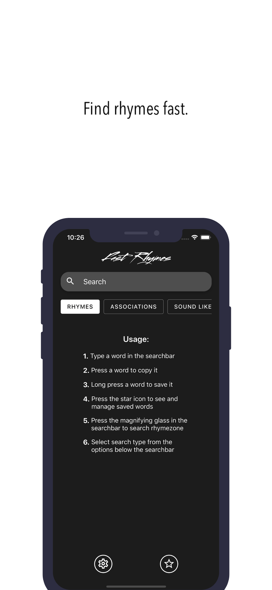
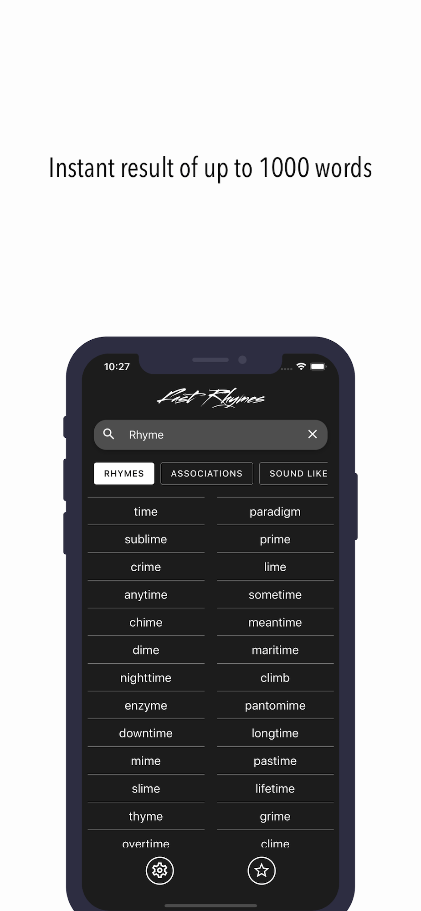
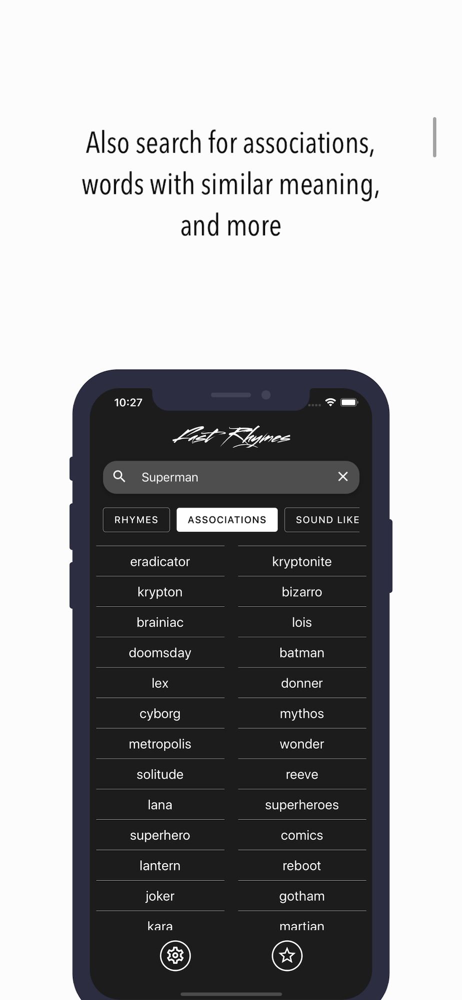
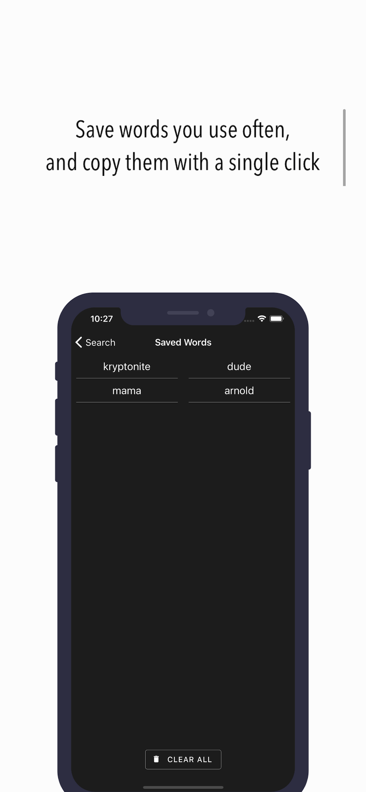
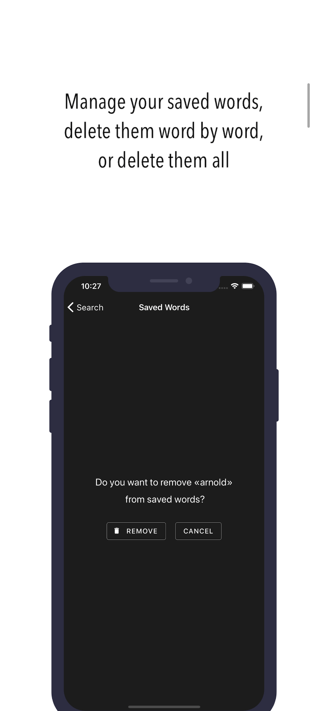
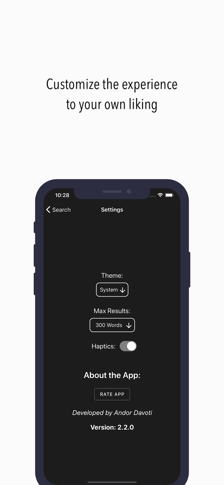

# Fast Rhymes iOS and android app

Search for a word and get a list of words that rhyme. The app uses the Datamuse API to get the data. The app also supports system-wide dark mode.

## **Screenshots:**

## **Downloads:**

**Play Store:** https://play.google.com/store/apps/details?id=rhyme.dictionary.mobileapp

**App Store:** https://apps.apple.com/us/app/fast-rhymes/id1492575811?ls=1
